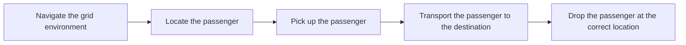
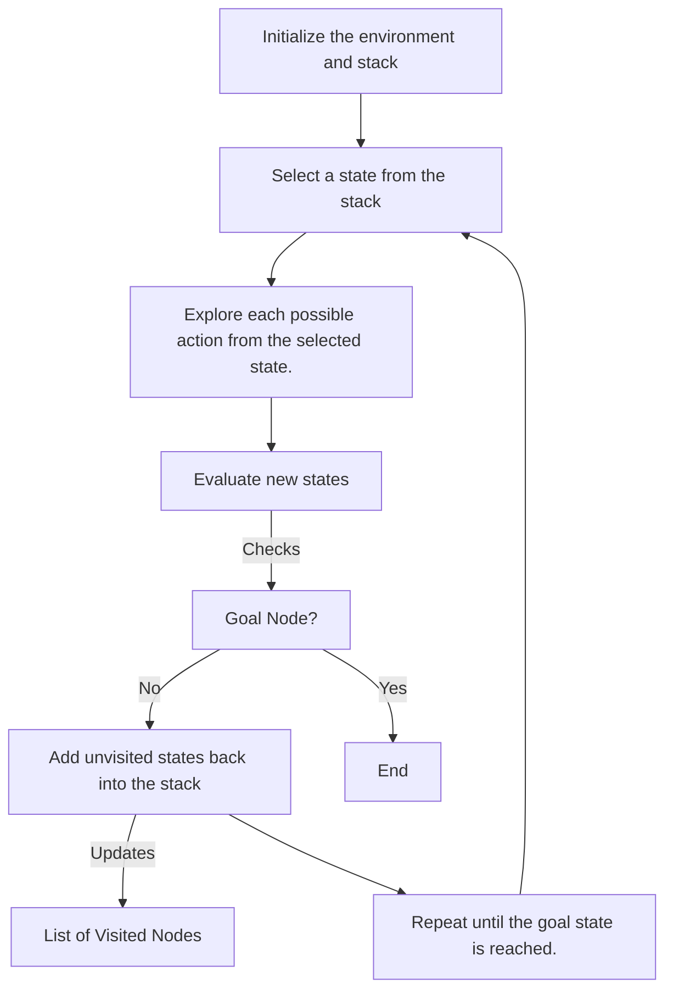
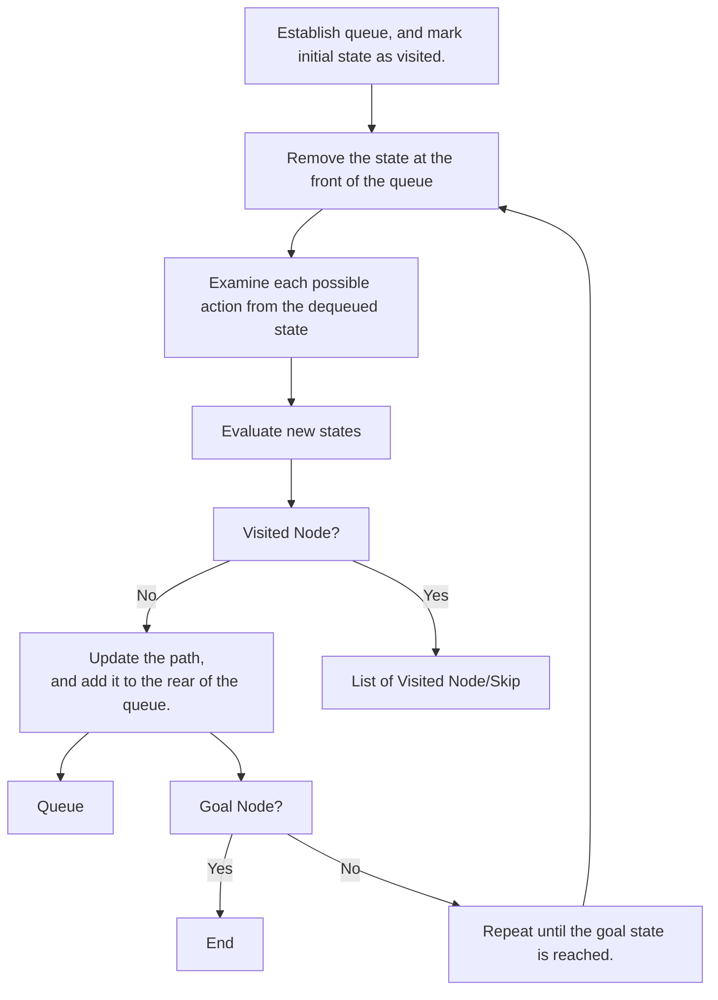

# 🚕 Taxi-v3 Intelligent Search Agent

An intelligent agent developed using classical search algorithms to solve the **Taxi-v3 environment from Gymnasium.**  

The agent navigates a taxi in a grid world environment to **pick up a passenger** and **deliver them to a destination** while **maximizing rewards** and **minimizing penalties.**  

This project evaluates three search strategies:

- Depth-First Search (DFS)
- Breadth-First Search (BFS)
- A* Search

The algorithms are implemented and compared to analyse their performance in terms of:

- Execution duration
- Number of steps explored
- Path efficiency

## Project Objective

The goal of this project is to develop an intelligent agent capable of navigating a taxi environment and determining the optimal sequence of actions required to complete a passenger transportation task. 

The agent must:

The task is completed when the passenger is successfully dropped off at the designated destination state. 

## Environment Description

The system uses the Taxi-v3 environment provided by Gymnasium. 

Grid Configuration: 
- Grid size: **5 × 5**
- Total possible taxi locations: **25**

Passenger and destination states are represented using the following locations:
| Code | Location |
| ----- | ----- |
| 0 | Red |
| 1 | Green |
| 2 | Yellow |
| 3 | Blue |
| 4 | Passenger in Taxi |

These locations represent both passenger pickup and drop-off points.

## Taxi Actions
The taxi agent can perform **six discrete actions**, allowing the taxi to move through the environment and complete the pickup and delivery task . 

| Action | Description |
| ----- | ----- |
| 0 | Move South |
| 1 | Move North |
| 2 | Move East |
| 3 | Move West |
| 4 | Pick Up Passenger |
| 5 | Drop Off Passenger |

## Reward System

The reward structure encourages efficient pathfinding and penalizes incorrect actions.
This design encourages the agent to find the shortest and most efficient path to complete the task.

| Event | Reward/Penalties |
| ----- | ----- |
| Move action | -1 |
| Illegal pickup/dropoff | -10 |
| Successful dropoff | +20 |

## Search Problem Components

The taxi task is formulated as a search problem consisting of several key elements.

### Initial State (starting configuration of the environment)

The initial state is defined by:
- taxi’s grid position
- passenger’s pickup location

### Goal State

The goal state is reached when:
- passenger is successfully delivered to the correct destination. 

### Transition Model

Each action taken by the taxi results in a deterministic state transition within the environment.

Examples include:

- movement changing the taxi’s grid position
- pickup actions placing the passenger inside the taxi
- drop-off actions completing the task when performed at the correct location.

# Algorithms Implemented

### 1. Depth-First Search (DFS)

Depth-First Search explores the search space by expanding the **deepest nodes first before backtracking.**
The algorithm uses a **stack structure**, allowing it to follow a path deeply until it reaches a goal state or a dead end.

DFS workflow:

### 2. Breadth-First Search (BFS)

Breadth-First Search explores the search space **level by level**, examining all neighboring states before moving deeper.

The algorithm uses a **queue structure (FIFO)** to ensure states are expanded in order of depth.

### 3. A* Search

A* Search is an informed search algorithm that uses a heuristic function to guide exploration toward promising states.

It uses a priority queue where the priority is determined by: **f(n) = g(n) + h(n)**

- **g(n)** = cost to reach the current state
- **h(n)** = heuristic estimate of distance to the goal

### Performance Comparison

| Algorithm | AvgDuration (ms) | Avg Steps | Avg Path Length |
| ----- | ----- | ----- | ----- |
| DFS | 0.012 | 113.126 | 11.493 | 
| BFS | 0.018 | 124.491 | 11.013 | 
| A* | 0.010 | 89.891 | 11.013 |

- A* achieved the best overall performance in both execution time and number of explored steps.
- BFS guarantees optimal path length but requires more exploration.
- DFS can reach solutions quickly but may produce longer paths.

